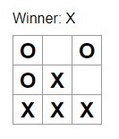
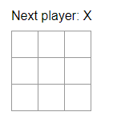
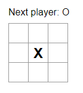

# TicTacToe

This app is a simple TicTacToe game, made with React, mainly using JavaScript

# Getting Started

In order to launch the app, you need to do the following:

- If not done already, Install [Node.js](https://nodejs.org/en)
- Open a terminal inside the tictactoe folder
  - run `npm install`
  - after this is done, `npm start`

If this is done correctly, the application will now be running locally and a browser Window will open. 

>If it somehow doesn't open a window, open http://localhost:3000/ manually

Now you should see an empty TicTacToe Grid With the Current player displayed above.

Here, you can simply click any of the 9 fields to play your turn. 

>At the current state of the app, it is required to simply reload the page to restart a game.